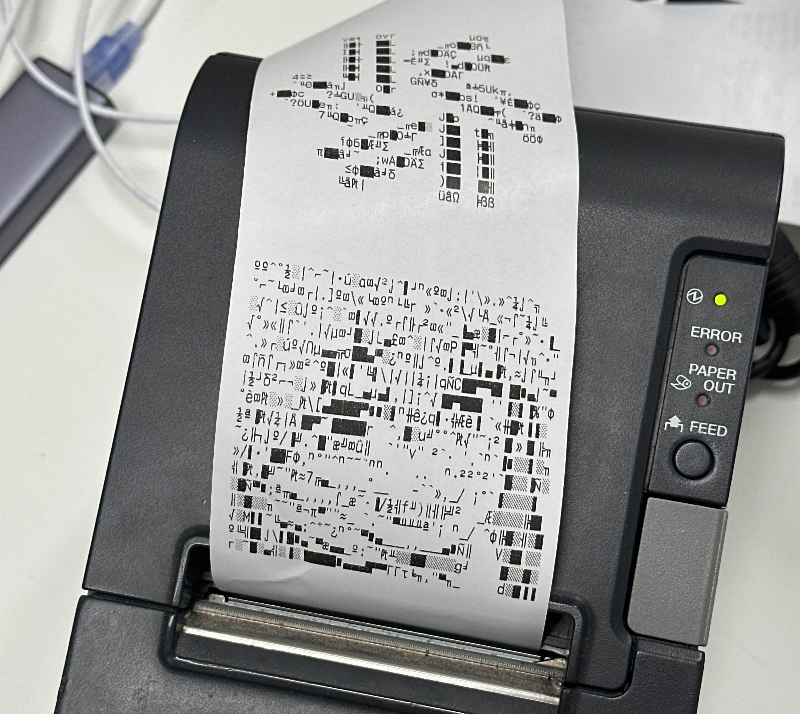
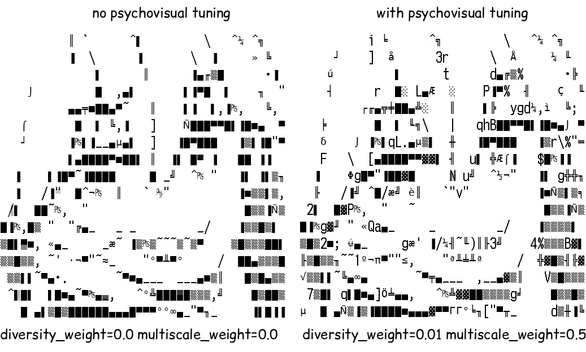
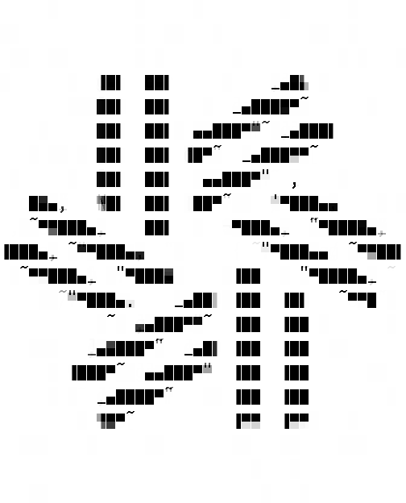
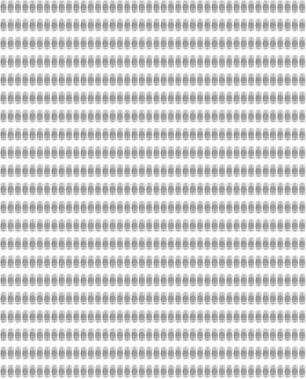
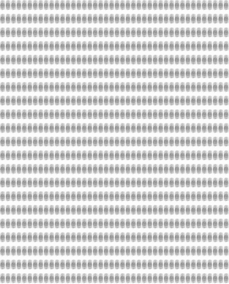

# Subpixel ASCII Art via Gradient Descent

An approach to ASCII art generation that uses gradient descent optimization instead of lookup tables. This project produces high-quality ASCII art by treating character selection as a differentiable optimization problem.

Is it overkill? Yes but fuck it we ball

⚠️⚠️⚠️⚠️ **this readme is vibed by claude so don't judge me if it's written in a npc like way** ⚠️⚠️⚠️⚠️

## Gallery

### [Bad Apple](https://x.com/gf_256/status/2015012967427854573)

EXPERIENCE IT LIVE:

```
telnet bad.apple.zellic.io

-= or =-

nc bad.apple.zellic.io 23

-= or =-

ssh badapple@bad.apple.zellic.io 
```

or https://bad.apple.zellic.io

YES IT SUPPORTS ANIMATIONS WITH TEMPORAL REGULARIZATION LOSS

---




---

Demonstration of psychovisual tuning



- Diversity loss weight: penalty for using the same characters over and over again (adds noise = looks better. less banding etc)
- Multiscale loss weight: also downscale the learned and target image and compute loss over that too (makes it do dithering)

---

Default settings

 

---

Diversity weight 0.0 and disable annealing:

 

Diversity weight 0.02 and 0.01:

 

---

Benchmarks / torture tests

 

 

---

Identity mapping test


## Warping

Learnable affine transformation (scale+translate), warp matrix. Is this totally overkill? Yes! Does it make results significantly better? Yes!

Without warping enabled (only scaling and translation), we struggle to learn an identity mapping because the input raster are misaligned with the character grid.


With warping enabled, we successfully learn significant part of the identity mapping. This is not easy!


Warping significantly improves reconstruction loss by leveraging "row gaps" as part of the pattern allowing for cleaner horizontal and vertical edges. In practice even substantial warping is not noticeable in the final result.


 


Pay attention to the lips, bottom edges of the eyes, bottom of the chin, and eyebrows. They become aligned with the character grid so the row gaps can be used to create clean horizontal edges. Pay attention to the split in the middle of the bangs, the right side of the face near the temple, and various vertical lines in the hair. This becomes aligned with a column boundary to create a clean vertical edge.


## Dynamic contrast (and dark mode)

Learnable contrast curve per each point on the character grid is bilinearly interpolated. Dark mode is also supported as shown in this image


Yes this is completely overkill and it's mostly an artistic effect to add a fuck ton of shading like those old 90s ansi files.

```
Curve Non-linearity Map (deviation from identity):                                                                09:43:06 [15/56867]
  +--------------------------------+
  |     ...-::==+=====:-..         |
  |        .-:=++++===::-.         |
  |....     -:=+++++===:-..---.    |
  |...      .:=++**++===:::::::-...|
  |         .-=+***++======+++==:::|
  |        .-:=++**+++++++******+++|
  |.-----..-:=++**++++++***#******+|
  |::=:::-::=++***+++++***##***###*|
  |=++======+++****+++***###****###|
  |++++++++++++****+++*************|
  |*******+++++*****+++**********++|
  |#####**+==+++*****+++********+++|
  |#####**+===+++****++=+****++++++|
  |#@###**+======+***+=:=++++===+**|
  |#####***++=:::=++*=::=++==:=++**|
  |#####****++::::=++=::====::=+***|
  +--------------------------------+
  Range: 0.006 (linear) to 0.291 (very non-linear)

  Learned Contrast Curve (Center Control Point):
  +--------------------------------+
  |                    .^```'''''' |
  |                  .`            |
  |                .`              |
  |               -                |
  |              `                 |
  |            _'                  |
  |           -                    |
  |          ^                     |
  |         `                      |
  |       _'                       |
  |      .                         |
  |     .                          |
  |    -                           |
  |   -                            |
  |  ^                             |
  |_`                              |
  +--------------------------------+
  0               input            1
```

## Dynamic RGB to Grayscale color mapping

This is necessary for input images with information mostly in the chrominance channel. We learn a small MLP to separate colors cleanly in grayscale. Pay attention to the color of Patrick (orange) and the sweater (purple). These have similar luminance, so without color mapping, Patrick's face is indistinguishable from his body. Patrick's eyes are also difficult to distinguish from his face without discontinuous color mapping.

 

```
Learning LAB→grayscale mapping for maximum separability (250 iterations)...
  Architecture: LAB(3) -> Dense(16) -> ReLU -> Dense(8) -> ReLU -> Dense(1) -> Sigmoid
  Iteration 0/250: cluster=0.0005, separate=0.2444, luma=0.0842, lr=0.000000
  Iteration 50/250: cluster=0.0067, separate=0.0607, luma=0.0134, lr=0.009698
  Iteration 100/250: cluster=0.0137, separate=0.0043, luma=0.0008, lr=0.007500
  Iteration 150/250: cluster=0.0120, separate=0.0042, luma=0.0008, lr=0.004132
  Iteration 200/250: cluster=0.0130, separate=0.0031, luma=0.0008, lr=0.001170
  Iteration 249/250: cluster=0.0124, separate=0.0062, luma=0.0008, lr=0.000000
LAB→grayscale learning complete.
  Output brightness range: [0.067, 0.853]
  Saved grayscale result to: rgb_curves_output.png
```

## Overview

Traditional ASCII art converters work by mapping pixel brightness to characters with similar visual density. This project takes a fundamentally different approach: we **optimize character placement directly** by minimizing the difference between the rendered ASCII art and the target image.

### How It Works

Instead of pre-computing which character "looks like" each pixel pattern, we:

1. **Start with random character selections** across a grid
2. **Render the ASCII art** by looking up character bitmaps and compositing them
3. **Compare to the target image** using mean squared error (MSE)
4. **Use gradient descent** (AdamW optimizer) to adjust which characters to place
5. **Iterate** until the rendered ASCII art closely matches the target

The key insight is making character selection **differentiable** through softmax: instead of picking one character per position, we render a weighted blend of all possible characters, where the weights come from softmax logits. During training, gradients flow back to these logits, gradually learning which characters to place where.

## Features

### Core Capabilities

- **Gradient Descent Optimization**: Uses PyTorch and AdamW to optimize character placement
- **GPU Acceleration**: Runs on Apple Silicon (MPS), CUDA, or CPU
- **CP437 Support**: Full support for IBM PC Code Page 437 (Epson receipt printers)
- **Multiple Presets**: Pre-configured settings for receipt printers and Discord text blocks
- **Vectorized Rendering**: Fast GPU-accelerated character composition
- **Font Fallback**: Uses printer fonts for ASCII, fallback fonts for extended characters

### Artistic/psychovisual Options

- **Row Gap Support**: Simulates printer spacing for realistic output
- **Character Diversity Penalty**: Encourage varied character usage by incorporating into loss function
- **Downscaled (multiscale) reconstruction loss**: Encourage dithering by also comparing if downscaled image looks good too. Done with a quick convolution

### Learning Techniques

- **Temperature Annealing**: Forces discrete character selection by gradually sharpening softmax distributions
- **Diversity Loss**: Entropy regularization encourages varied character usage
- **Cosine Learning Rate Schedule**: Smooth learning rate decay with warmup

## Installation

### Requirements

Pytorch (learning stuff) and Pillow (font rendering)

```bash
pip install -r requirements.txt
```

### Fonts

Place your fonts in a `fonts/` directory:

- **Receipt Printer**: `fonts/bitArray-A2.ttf` (24pt bitmap font)
- **Discord**: `fonts/gg mono.ttf` and `fonts/SourceCodePro-VariableFont_wght.ttf`
- **Fallback**: System fonts (Menlo, Monaco) are used automatically

## Quick Start

### Basic Usage

```bash
python train.py test.png
```

This uses the default "Epson" preset optimized for receipt printers.

## Command Line Options

### Presets

- `--preset epson`: Receipt printer (CP437, bitArray-A2 font, 6px row gap)
- `--preset discord`: Discord text block (ASCII, gg mono font, no row gap)

### Grid Configuration

| Option | Default | Description |
|--------|---------|-------------|
| `--char-width` | 12 | Character width in pixels |
| `--char-height` | 24 | Character height in pixels |
| `--grid-width` | 42 | Number of characters per row |
| `--grid-height` | 21 | Number of character rows |
| `--row-gap` | 6 | Gap between rows (0 for Discord, 6 for printer) |

### Character Set

| Option | Default | Description |
|--------|---------|-------------|
| `--encoding` | cp437 | Character encoding (cp437 or ascii) |
| `--ban-chars` | `` `\ `` | Characters to exclude |
| `--ban-blocks` | - | Flag to ban block chars (░▒▓█▄▌▐▀■) |

### Training Hyperparameters

| Option | Default | Description |
|--------|---------|-------------|
| `--iterations` | 10000 | Number of training iterations |
| `--lr` | 0.01 | Learning rate |
| `--warmup` | 1000 | Warmup iterations before LR decay |
| `--diversity-weight` | 0.01 | Weight for diversity loss (0 to disable) |
| `--no-protect-whitespace` | - | Include whitespace in diversity penalty |

### Gumbel-Softmax

| Option | Default | Description |
|--------|---------|-------------|
| `--no-gumbel` | - | Disable Gumbel-softmax (use plain softmax) |
| `--temp-start` | 1.0 | Starting temperature (higher = more exploration) |
| `--temp-end` | 0.1 | Ending temperature (lower = more discrete) |
| `--save-temp` | 0.01 | Temperature for final output rendering |

### Output

| Option | Default | Description |
|--------|---------|-------------|
| `--save-interval` | 100 | Save intermediate results every N iterations |
| `--output` | output.png | Output image path |
| `--output-text` | output.txt | Output text file (native encoding) |
| `--output-utf8` | output.utf8.txt | Output text file (UTF-8) |

## Technical Deep Dive

### Differentiable Rendering

The core idea is making ASCII art rendering differentiable:

```python
# Soft character selection via softmax
weights = torch.softmax(logits / temperature, dim=-1)  # (H, W, NUM_CHARS)

# Vectorized rendering using einsum
rendered_grid = torch.einsum('ijk,khw->ijhw', weights, char_bitmaps)
# Result: weighted blend of all character bitmaps at each position
```

During training, `weights` represent a probability distribution over characters. As training progresses and temperature decreases, the distributions become more peaked until eventually one character dominates each position.

### Temperature Annealing (Why We Need It)

The core problem: during training, softmax produces **weighted blends** of characters, but the final output must be **discrete** - you can't render "50% '@' and 50% '#'" on a receipt printer.

Temperature-scaled softmax controls the sharpness of selection:

```python
# Temperature-scaled softmax
weights = torch.softmax(logits / temperature, dim=-1)
```

- **High temperature** (1.0): Soft, uniform distribution → blends many characters
- **Low temperature** (0.01): Sharp, peaked distribution → nearly one-hot (discrete)

By annealing temperature from high to low during training, we:
1. Start with soft blending (easy to optimize, smooth gradients)
2. Gradually force discrete selection (penalty for being "undecided")
3. End with nearly discrete outputs that match real rendering

Optional Gumbel noise can be added for exploration, but the key benefit is the annealing schedule forcing commitment to specific characters.

We anneal temperature following the cosine learning rate schedule:

```python
lr_ratio = current_lr / initial_lr
temperature = temp_start + (temp_end - temp_start) * lr_ratio
```

### Diversity Loss

Without regularization, the optimizer will overuse a few characters (block characters, spaces, hashtag, etc). We add entropy regularization:

```python
# Character usage distribution
char_usage = weights.mean(dim=[0, 1])  # Average across all positions

# Entropy: -sum(p * log(p))
entropy = -(char_usage * torch.log(char_usage + 1e-10)).sum()

# Maximize entropy (minimize negative entropy)
diversity_loss = -entropy
```

This encourages the model to use a variety of characters. Whitespace is excluded from this penalty by default since it's naturally needed for empty areas.

### Row Gap Simulation

Receipt printers have physical gaps between rows. We simulate this by inserting white space:

```python
if ROW_GAP > 0:
    rendered = torch.ones((IMAGE_HEIGHT, IMAGE_WIDTH))
    for i in range(GRID_HEIGHT):
        y_start = i * (CHAR_HEIGHT + ROW_GAP)
        y_end = y_start + CHAR_HEIGHT
        rendered[y_start:y_end, :] = rendered_grid[i]
```

The target image is resized to content dimensions then padded, ensuring the optimizer doesn't try to put content in the gap areas.

This hybrid approach gives authentic printer rendering for ASCII while supporting the full CP437 character set for extended graphics.

## Loss Function

The total loss combines reconstruction and diversity:

```python
# Reconstruction loss: MSE between rendered ASCII and target image
recon_loss = MSELoss(rendered, target_image)

# Diversity loss: negative entropy of character usage
char_usage = weights.mean(dim=[0, 1])
entropy = -(char_usage * torch.log(char_usage + 1e-10)).sum()
diversity_loss = -entropy

# Total loss
loss = recon_loss + diversity_weight * diversity_loss
```

Typical `diversity_weight` values: 0.0-0.1. Higher values harm reconstruction quality.

## Training Process

### Learning Rate Schedule

We use a cosine annealing schedule with linear warmup.

1. **Warmup** (0-1000 iterations): Linear ramp from 0 to learning rate
2. **Cosine decay** (1000-10000 iterations): Smooth decay following cosine curve

```python
if iteration < warmup:
    lr_multiplier = iteration / warmup
else:
    progress = (iteration - warmup) / (total - warmup)
    lr_multiplier = 0.5 * (1.0 + cos(π * progress))
```

This helps stabilize early training and enables fine-tuning at the end.

### Typical Training Run

- **Iterations**: 10,000-20,000
- **Learning rate**: 0.01
- **Warmup**: 1,000 iterations
- **Time (M1 Max)**: ~3-5 minutes for 10,000 iterations
- **Memory**: ~500MB GPU memory

Progress is displayed with loss, learning rate, and temperature:

```
100%|████████| 10000/10000 [03:24<00:00, recon: 0.0023, div: -3.21, lr: 0.0001, temp: 0.0821]
```

### Intermediate Results

Results are saved every 100 iterations to `steps/`:

- `steps/i_iter_0000.png` - Rendered image at iteration 0
- `steps/t_iter_0000.txt` - Text output at iteration 0
- `steps/i_iter_0100.png` - Rendered image at iteration 100
- ...

This lets you watch the ASCII art evolve during training or create animations.

## Output Files

After training completes, you get:

- `output.png` - Final rendered ASCII art image
- `output.txt` - Text file in native encoding (CP437 or ASCII)
- `output.utf8.txt` - Text file converted to UTF-8 (for viewing in editors)

The text files can be printed directly to receipt printers or pasted into Discord.

## Why This Works

Traditional ASCII art uses a lookup table: for each pixel or region, pick the character that "looks most similar." This has limitations:

1. **Local decisions**: Each character is chosen independently
2. **Perceptual mismatch**: Character similarity is hard to define
3. **No global optimization**: Can't adjust one character based on neighbors

Our gradient descent approach overcomes these:

1. **Global optimization**: All characters are optimized together
2. **Objective metric**: Directly minimizes pixel-level difference
3. **Adaptive**: Learns what characters work best for your specific font/printer

The result is ASCII art that genuinely optimizes for visual similarity rather than relying on pre-computed LUT.

## Comparison to Traditional Methods

| Traditional LUT | This Project |
|-----------------|--------------|
| Pre-compute character→pattern mapping | Learn character placement via optimization |
| Local per-pixel/region decisions | Global optimization across entire image |
| Fast (lookup) but fixed quality | Slower (gradient descent) but better quality |
| One-size-fits-all character weights | Adapts to your specific fonts and settings |
| No fine-tuning | Can continue training for refinement |

## Tips & Tricks

### Getting Better Results

1. **More iterations**: 10,000 for high quality. 1,000 with higher LR suffices for quicker testing
2. Play with diversity weight. Recommend trying 0.0, 0.01, 0.02, 0.04. Lower is more accurate but higher is more artistic / may look nicer due to psychovisual effects
4. Enable or disable Gumbel softmax annealing
5. **Ban problematic characters**: Use `--ban-chars` to exclude characters that render poorly or make the output visually/artistically uninteresting

### Performance

- Runs 10,000 epochs in about 5 seconds on M2 Mac

## Inspiration

This project was inspired by the subpixel ASCII art technique from [Underware's case study](https://underware.nl/case-studies/subpixel-ascii-plus-art/), which divides each character into a 3×3 grid and uses lookup tables to map patterns to characters.

We take the core idea of treating characters as rendering primitives with spatial detail, but replace the lookup table approach with gradient descent optimization.

## License

AGPL. If you (a third party) wish to incorporate or redistribute this software (including without limitation a SaaS product), you must reach out to negotiate a commercial license.

## Thanks

This project is sponsored by [Zellic](https://zellic.io). We do the best security reviews in the world


If you're smart, like working on interesting problems, and want to work with the best hackers in the world, [we're hiring](https://zellic.io/jobs).
